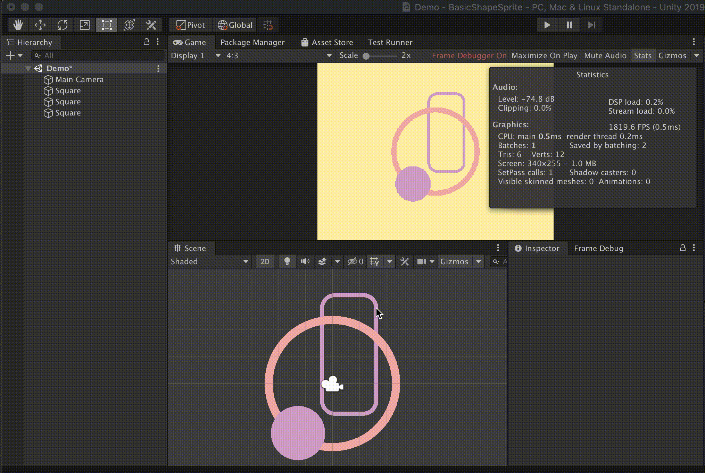

# BasicShapeSprite

https://github.com/kyubuns/BasicShapeSprite

## 出来ること

- キレイな角丸四角とか円が描ける
  - 綺麗なまま拡縮出来る！！！！すごい！！！！
- どれだけ描いてもSetPass Callが1

- 左上だけ角丸にする、とか角ごとに指定が出来る

## 基本的な使い方

- SquareComponent, Mesh Filter, Mesh Rendererを貼り付けたGameObjectを作る
- Mesh Rendererのマテリアルを、BasicShapeSprite/Materials/以下に入っているものにする
- おしまい

## 直接シェーダーを呼び出す

- 以下の情報を渡してメッシュを描画する
- uv1(float4)
    - [0] : x (0.0f - w)
    - [1] : y (0.0f - h)
    - [2] : w
    - [3] : h
- uv2(float2)
    - [0] : 角丸のR
    - [1] : 枠の幅
- uv3(float4)
    - 各角を角丸にするかどうか(1.0f or 0.0f)
    - [0] : 左下
    - [1] : 左上
    - [2] : 右下
    - [3] : 右上
